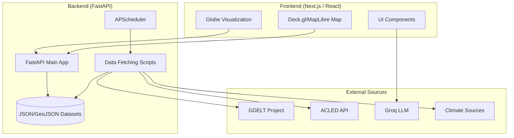

# Invisible Systems Map

Real-time data visualization platform for monitoring global "invisible" infrastructure and geopolitical stressors. This project provides a multi-dimensional perspective on the world by mapping critical systems that are often hidden: subsea cables, climate stress points, conflict zones, and supply chain dependencies.

## Architecture Overview

The project is built on a modern decoupled architecture:



### Frontend (Visual Intelligence Engine)
- **Framework**: Next.js 16 with React 19 (Server-side rendering & optimized hydration).
- **3D Visualization**: `Globe.gl` (Three.js-based) for high-performance interactive 3D globes.
- **Geospatial Mapping**: `MapLibre GL` and `Deck.gl` for layered 2D/3D map views and complex spatial data rendering.
- **Styling**: Tailwind CSS v4 with custom glassmorphism and modern UI components.

### Backend (Data & Orchestration Layer)
- **Framework**: FastAPI (Python) – High-performance asynchronous API services.
- **Scheduling**: `APScheduler` manages periodic background data ingestion tasks.
- **AI Intelligence**: Strategic integration with **Groq (LLM)** for providing real-time intelligence briefs on infrastructure nodes.
- **Persistence**: Hybrid approach using PostgreSQL (planned/in-progress) and locally stored optimized JSON GeoJSON datasets.

## Module Breakdown

### backend/
- **app/main.py**: The central FastAPI application. Manages API routing, background scheduling, and AI analysis pipelines.
- **app/models.py**: Pydantic data models for structured API responses.
- **scripts/**: A suite of specialized data fetchers:
  - `fetch_conflicts.py`: Ingests and processes conflict data from sources like GDELT and ACLED.
  - `fetch_cables.py`: Maps the physical internet backbone (subsea fiber-optic cables).
  - `fetch_climate.py`: Real-time fetching of climate stressors and temperature anomalies.
  - `fetch_supply_chain.py`: Traces critical resource flows and logistics nodes.
- **datasets/**: Directory for storing static and cached geospatial data in GeoJSON/CSV formats.

### frontend/
- **src/components/GlobeComponent.tsx**: High-fidelity 3D globe using Three.js and Globe.gl. Handles interactive pulses and arcs for global connectivity.
- **src/components/MapComponent.tsx**: Advanced mapping integration using Deck.gl for heavy geospatial layers.
- **src/components/LayerPanel.tsx**: Dynamic UI for toggling between different invisible systems (Cables, Climate, Conflict).
- **src/components/InfoPanel.tsx**: Side panel for displaying detailed node properties and AI-generated intelligence briefs.

## Getting Started

### Backend Setup
1. Navigate to the `backend/` directory.
2. Install dependencies:
   ```bash
   pip install -r requirements.txt
   ```
3. Configure environment variables in `.env` (API keys for Groq, GDELT, etc.).
4. Start the server:
   ```bash
   uvicorn app.main:app --reload --port 8000
   ```

### Frontend Setup
1. Navigate to the `frontend/` directory.
2. Install packages:
   ```bash
   npm install
   ```
3. Run the development server:
   ```bash
   npm run dev
   ```

## Tech Stack
- **Languages**: TypeScript, Python
- **UI/UX**: React 19, Next.js 16, Tailwind CSS 4, Lucide Icons
- **Mapping**: Globe.gl, Deck.gl, MapLibre GL, Three.js
- **API**: FastAPI, Pydantic, HTTPX
- **Data Source Integrations**: GDELT Project, ACLED API, Groq LLM (Llama-3)

---
*Created as part of the Invisible Systems Mapping Initiative.*
